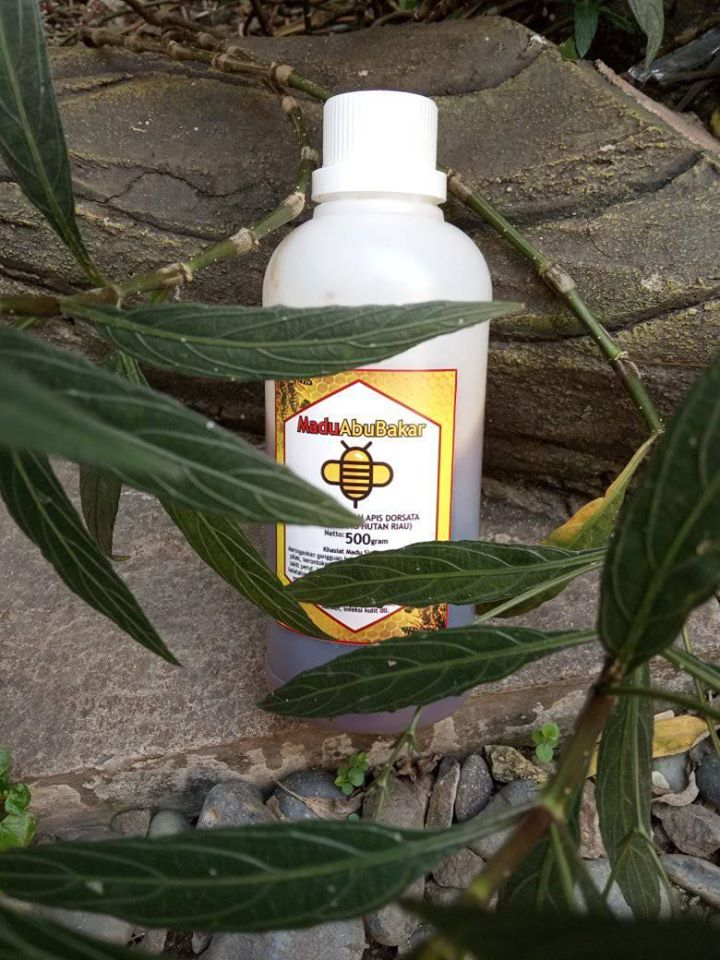

## Ketika Madu Sialang Kian Sedikit dan Sulit Didapat ##

Masyarakat adat Dawas dan Tungkal Ulu di Kabupaten Musi Banyuasin (Muba), Sumatera Selatan, dulu hidup berkecukupan dengan mengandalkan madu sialang. Kini, produksinya kian sedikit, kenapa?

Sialang merupakan penyebutan masyarakat di Muba untuk pohon menggeris (Koompassia excelsa). Pohon yang hidup di hutan hujan ini umumnya tumbuh di dataran rendah, tapi juga ditemukan di dataran sedang. Tingginya dapat mencapai 88 meter.

Pohon sialang mempunyai nilai tersendiri bagi masyarakat Dawas dan Tungkal Ulu. Pohon yang sebagian masih ditemukan di sejumlah hutan dan kebun warga ini, umumnya berada di tepi sungai, hampir sepanjang tahun memberikan penghasilan bagi mereka. Madu, yang diambil dari sarang lebah liar. Minimal ada sepuluh sarang di pohon tersebut.

“Madu sialang” begitulah umumnya masyarakat setempat menyebutnya. “Madu sialang” dari Dawas dan Tungkal Ulu ini cukup terkenal bagi penikmat madu di Palembang dan Jambi.

Dahulu, sebelum maraknya perkebunan sawit dan HTI (Hutan Tanaman Industri), serta pertanian rakyat, pohon sialang banyak ditemukan di Dawas dan Tungkal Ulu. Kepemilikannya umum, milik warga dusun, ataupun desa. Pohon dirawat bersama. Ketika panen dilakukan bareng-bareng, hasilnya dibagi rata.

Mengapa pohon sialang dirawat bersama? Selain banyak lebah liar yang membuat sarangnya, menghasilkan madu, juga menebang pohon ini sangat sulit. Kayunya keras sehingga sering merusak mata gergaji.

Kini, pohon sialang yang tersisa tidak lagi dimiliki masyarakat. Pemiliknya lebih ke perseorangan yaitu pengelola atau penggarap lahan, tempat pohon itu tumbuh.

### Tradisi panen ###
Memanen madu sialang tidak begitu saja dilakukan, ada tradisinya. Umumnya, saat bulan gelap atau hanya sebagian wujud bulan yang terlihat di malam hari. Panen dilakukan dua bulan sekali, rata-rata tiga hingga empat kali di setiap pohon sialang yang memiliki sarang madu lebah liar.

Kelompok yang akan memanen, berkisar 5-8 orang, akan melakukan ritual adat atau berdoa bersama yang dipimpin seorang pawang yang juga anggota tim. Pawang ini dipanggil “pawang madu” yang dinilai memiliki kekuatan atau ilmu kebatinan terkait proses pengambilan madu.

Pada masyarakat adat Dawas dan Tungkal Ulu, yang berbatasan dengan kawasan SM Dangku, terdapat banyak pawang, selain pawang madu, ada juga pawang ular, pawang beruang, dan lainnya. “Tapi banyak pawang yang sudah meninggal dunia, dan tidak banyak yang meneruskan ilmunya,” kata Yusri Arafat, warga masyarakat adat Tungkal Ulu.

Setelah doa bersama, tim menyiapkan sejumlah bahan, seperti tali dari rotan atau akar, dan sepotong kayu yang panjangnya 60 sentimeter. Tali akar diikatkan ke sepotong kayu itu.

Pawang bersama tiga anggotanya kemudian naik pohon, selain membawa potongan kayu, golok, juga ada kulit kayu pohon merawan yang sudah ditumbuk. Tak lupa, sebuah jerigen atau tempat menampung madu dan sarangnya diikutsertakan.

Setelah di atas, tidak jauh dari sarang madu, kulit kayu merawan yang sudah ditumbuk dan diikat seperti sapu lidi itu dibakar. Didekatkan ke sarang lebah liar yang akan dipanen. Tak lama kemudian lebah itu keluar dan mengikuti kayu merawan yang dibakar. Asapnya juga membuat lebah-lebah liar itu meninggalkan sarangnya, dan berputar mengelilingi pohon sialang.

Selanjutnya pawang yang sepanjang proses itu mulutnya membacakan sejumlah doa atau mantra, bersama asistennya membelah sarang lebah, yang kemudian memasukkannya ke jerigen. Lalu, jerigen diturunkan menggunakan tali, yang disambut anggota tim lain. Potongan sarang lebah itu berikutnya dipindahkan ke tempat baru. Jerigen ditarik kembali oleh asisten pawang ke atas. Proses ini dilakukan terus-menerus hingga setiap sarang labah tersisa seperempat. Proses yang sama dilakukan terhadap sarang lebah lainnya.

Mengapa sarang lebah liar yang dipanen harus disisakan? “Masyarakat percaya itu diberikan untuk para penunggu pohon sialang. Selain buat makhluk gaib, juga untuk harimau, elang, dan beruang,” kata Yusri.

Kearifan itu, kata Yusri, sebenarnya melestarikan sarang lebah di pohon sialang. Sebab jika masih ada sisa, lebah-lebah liar itu kembali membuat sarangnya yang sudah dipanen.

### Hutan habis, madu berkurang ###

Dijelaskan Yusri, ketika hutan mulai habis, selain jumlah pohon sialang berkurang, juga sarang lebah liarnya berkurang. Pada pohon sialang yang tingginya sekitar 50-60 meter, sarang lebahnya bisa puluhan. Tapi sekarang, jumlahnya hanya belasan.

“Penyebabnya, banyak pohon buah atau tanaman yang menghasilkan bunga mulai berkurang. Selain itu, madunya juga tidak sekental dulu, sekarang ini madunya lebih encer. Ada kemungkinan karena sumber madunya dari kembang tanaman yang tidak lagi variatif. Cenderung sama. Jika dekat kebun sawit, sumbernya dominan bunga buah sawit itu sehingga madunya lebih encer,” katanya.

Yusri berpendapat, jika madu lebah liar diolah secara benar akan menjadi sumber pendapatan masyarakat yang panjang. “Tinggal diatur pengelolaannya. Seperti mengembalikan kepemilikan bersama, dan hasilnya untuk bersama. Harga madu pun selalu naik, tidak pernah turun.”

Selain itu, mengembangkan madu dari sarang lebah liar ini juga mendorong masyarakat untuk menjaga lingkungan. “Misalnya, mempertahankan hutan di sekitar pohon sialang yang selalu dijadikan sarang lebah liar. Tak lupa, melakukan penanaman pohon sialang baru. Jika hutan terjaga, selain pohon sialang dipenuhi sarang lebah liar, juga hasil panen madunya lebih banyak, dalam setahun dapat dilakukan lebih empat kali,” jelasnya.

### Konflik ###

Sebagai informasi, beberapa tahun ini terjadi konflik antara masyarakat adat Dawas dan Tungkal Ulu dengan BKSDA Sumsel terkait lahan Suaka Margasatwa Dangku. Masyarakat yang mengklaim lahan tersebut sebagai tanah adat melakukan upaya pembukaan lahan dan mendirikan bangunan. Bukan hanya warga setempat, mereka juga sejumlah warga dari daerah lain, seperti Lampung.

BKSDA Sumsel kemudian melakukan penertiban, dengan melakukan perobohan rumah warga dan menangkap sejumlah tokoh adat yang membuat satu organisasi perjuangan. Masyarakat adat yang ditangkap ini kemudian ditahan.

Menteri Lingkungan Hidup dan Kehutanan (LHK) Siti Nurbaya pernah berjanji akan menyelesaikan konflik masyarakat adat dengan BKSDA Sumsel. Ini dinyatakannya saat bertemu Anwar Sadat, mantan Direktur Walhi Sumsel, yang sempat melakukan pendampingan dalam kasus tersebut.

Kemudian ada proyek Kelola Sendang (Sembilang-Dangku), yang merupakan proyek pemerintahan Sumatera Selatan dengan sejumlah organisasi internasional yang dipimpin ZSL (Zoological Society of London). Targetnya, menyelesaikan konflik tersebut.

“Bersama mitra, kita tengah mendiskusikan persoalan tersebut, dan mencarikan solusi, sehingga semua kepentingan dapat dipenuhi. Kita sangat perlu melindungi Dangku, tapi kita juga ingin masyarakat hidup sejahtera,” tutur Andjar Rafiastanto yang saat itu mewakili ZSL Indonesia.
