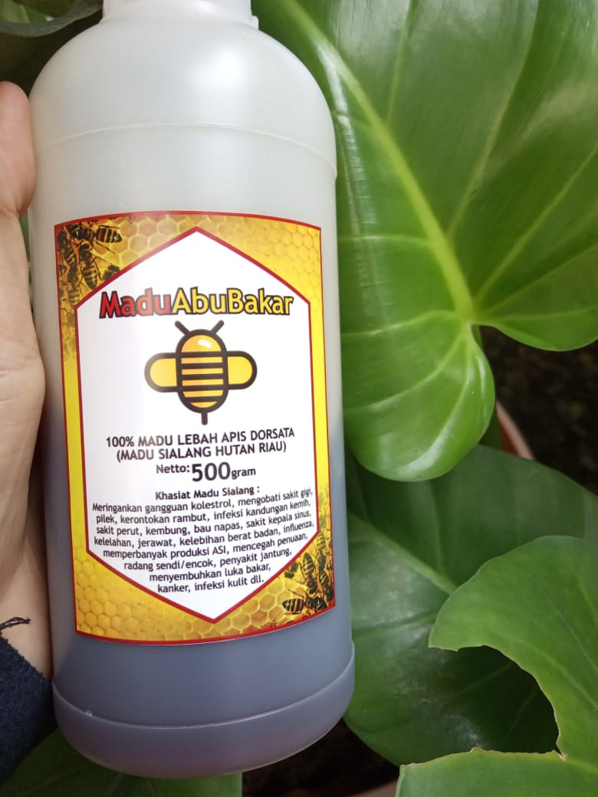

Provinsi Riau menyimpan satu kekayaan alam yang bermanfaat untuk kesehatan. Yakni Madu Sialang. Madu ini begitu terkenal hingga ke negeri jiran.

Bukan hanya karena khasiatnya. Tapi juga karena cerita dan cara pengambilan madunya yang terbilang unik.

Madu ini berasal dari kelompok lebah yang hidup dan bersarang di pohon-pohon Sialang. Pohon Sialang ini memiliki ciri ukuran batang yang besar dan tinggi.

Satu batang bisa berdiameter 100 cm dan tinggi 25- 50 meter. Satu pohon Sialang biasanya bisa dihuni 30-100 koloni sarang. Dimana tiap sarang bisa berisi 10 kilogram madu asli. 

Pohon Sialang sendiri merupakan jenis tumbuhan yang dilindungi. Baik hukum undang-undang pemerintah maupun hukum adat.

Proses pengambilan madu terbilang unik. Karena dilakukan oleh sekelompok orang yang biasa disebut pawang madu. Dibutuhkan cara khusus agar anakan madu tidak ikut terperas bersama sarang. Serta agar madu tak berubah menjadi hitam dan asam.

Sarang madu yang menyimpan madu dipanen oleh pawang madu, diturunkan ke tukang sambut. Lalu ditiris untuk diambil madunya.

Biasanya madu dikemas dalam jerigen atau botol minuman air mineral. Madu ini menjadi komoditi andalan setelah khasiatnya diketahui secara luas oleh masyarakat.

Selain menjaga daya tahan tubuh, banyak manfaat lain didapat jika mengkonsumsi madu asli ini.

Madu Sialang biasanya berasal dari Kabupaten Pelalawan, Kampar, Indragiri Hulu dan kabupaten lainnya di riau. 

Namun, walaupun Kota Tangerang bukanlah daerah penghasil Madu Sialang,  madu ini bisa dengan mudah juga didapatkan. Seorang pengusaha Madu Sialang di Tangerang bernama Muhammad Syukri mengatakan bahwa salah satu merk madu yang sedang naik daun adalah Madu Abu Bakar.

“Mengapa Madu Abu Bakar? Karena Madu Abu Bakar di Jamin ke Asliannya sebut Syukri yang merupakan putra Asli daerah Sumatra Riau ini."

Dijelaskannya, di dalam hutan itulah masyarakat adat hidup bersama alam dan menciptakan harmoni serta kesimbangan ekosistem hutan yang berkelanjutan.

“Cara hidup ini merupakan kearifan lokal yang diwariskan turun temurun dari para leluhur. Dalam hutan tersebut terdapat pohon sialang tempat bersarangnya lebah hutan yang menghasilkan madu atau raw natural honey,” tambahnya.

Proses panen Madu Sialang Madu Abu Bakar dilakukan dengan teknik panen lestari (sustainable harvesting) dan mengemasnya dengan baik agar manfaat hutan pedalaman dapat dirasakan melalui Madu Sialang.

Masih menurut Syukri, Madu Sialang ini bisa dipesan secara online melalui situs www.maduabubakar.com, harga Madu Sialang Asli ini dijual dengan harga Rp 100 ribu untuk kemasan 500gram dan Rp 45 ribu untuk ukuran kemasan 200gram, gratis ongkos kirim untuk wilayah Tangerang dan Sekitarnya.

