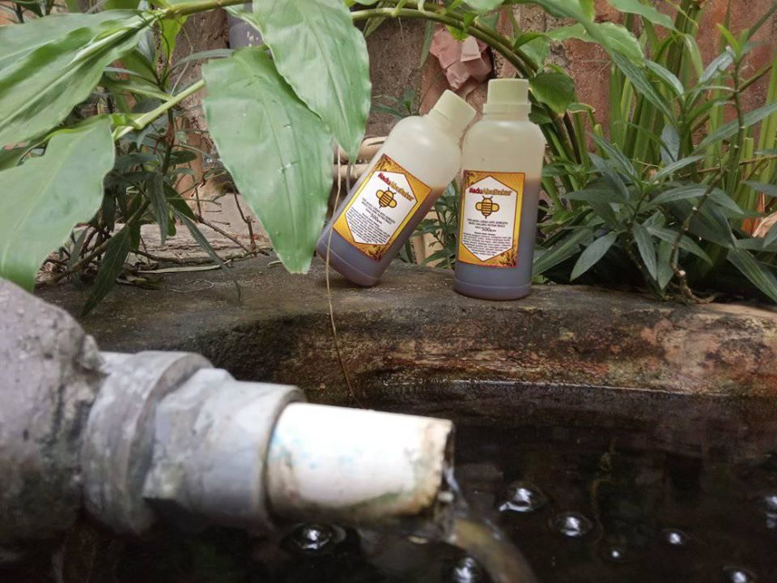

## Petani Madu Sialang Kewalahan Terima Pesanan ##

Para petani madu Sialang yang tergabung dalam Rumah Madu Andalan Kabupaten Pelalawan, Provinsi Riau, mengaku sempat kewalahan saat kebanjiran pesanan di tengah wabah Corona yang melanda penjuru negeri saat ini.

Tengku Indra alias Ujang, salah satu petani madu Sialang Kabupaten Pelalawan kepada Antara di Pekanbaru, Jumat (22/5), mengatakan dalam sebulan terakhir omzet kelompok tani madunya mencapai lebih dari Rp 100 juta atau meningkat tiga kali lipat dibanding sebelumnya.

"Kami sempat kewalahan menerima pesanan madu. Terakhir itu dari Jakarta sebanyak seribu botol atau sekitar 500 kilogram pada bulan April lalu," kata Ujang yang juga merupakan Ketua Kelompok Tani Rumah Madu Andalan (RMA) tersebut.

Ujang mengatakan madu Sialang termasuk jenis madu langka, mengingat untuk mendapatkannya petani harus menerobos hutan agar mendapatkan pohon sialang yang biasanya memiliki 8-10 sarang lebah. Untuk memanen madu ini, petani juga harus memanjat pohon sialang setinggi 60-80 meter yang biasanya dilakukan pada malam hari.

Untuk menjaga keberlanjutan produksi madu Sialang, maka Ujang berinisiatif membentuk kelompok tani yang terdiri dari tujuh petani madu Sialang di Pelalawan. Langkah Ujang mendapat dukungan dari PT Riau Andalan Pulp and Paper (RAPP) hingga terbentuk Kelompok petani madu Sialang Rumah Madu Andalan.

Saat ini, Ujang mengatakan terdapat 48 pohon madu sialang yang tersebar di tiga kabupaten di Riau, yakni Pelalawan, Siak, dan Kuantan Singingi. Hasilnya, setiap bulan Ujang dan kelompoknya bisa panen hingga 4 ton. Namun, selama ini madu tersebut belum terserap maksimal oleh pasar. Baru kemudian ketika pandemi corona seperti ini, pendapatannya meningkat pesat.

Ujang yang juga berprofesi sebagai nelayan ini mengatakan pembinaan dari program pemberdayaan RMA sangat membantu menjaga keberlanjutan produksi madu dan penghasilan anggotanya.

"Dulu semuanya dibabat habis dan terpaksa menunggu 4-5 bulan lagi lebahnya bersarang, lalu sejak dibina oleh RAPP, kami jadi paham konsep panen lestari, sehingga panen bisa dilakukan setiap bulan,” tuturnya.

Selain itu, sejak tahun 2006 madu Sialang juga mulai dilakukan pengolahan dan pengemasan modern tanpa mengurangi kemurniannya. Madu olahan tersebut juga diberi nama Madu Foresbi dan telah mengantongi ijin edar dari BPOM dan sertifikasi halal MUI.

Perwakilan PTRAPP, Raden Adhe Pramono mengatakan normalnya para petani memasok madu ke RMA sekitar 300 kilogram dan memperoleh rata-rata pendapatan minimal sebesar Rp 25 juta per bulan. Namun, kini permintaan terus meningkat selama wabah Corona, terutama untuk meningkatkan daya tahan tubuh masyarakat dengan mengkonsumsi madu.

Manajer CD RAPP, Binahidra Logiardi menambahkan program petani madu selaras tujuan pembangunan berkelanjutan (SDGs). Melalui pelatihan dan pendampingan, para petani madu juga tetap mampu bertahan dalam keadaan krisis, seperti kondisi Covid-19 saat ini.
